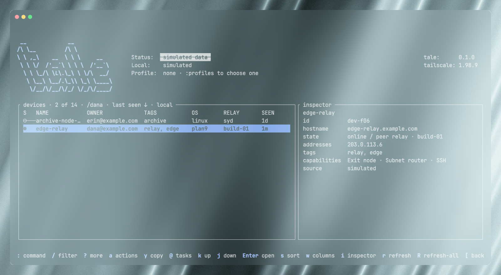
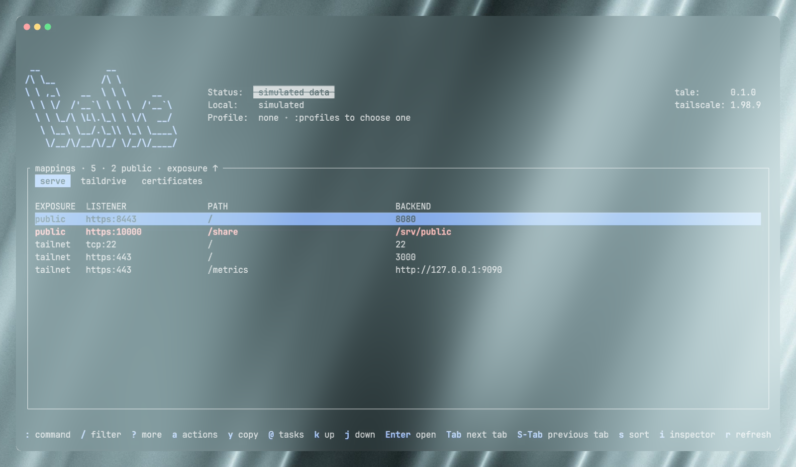
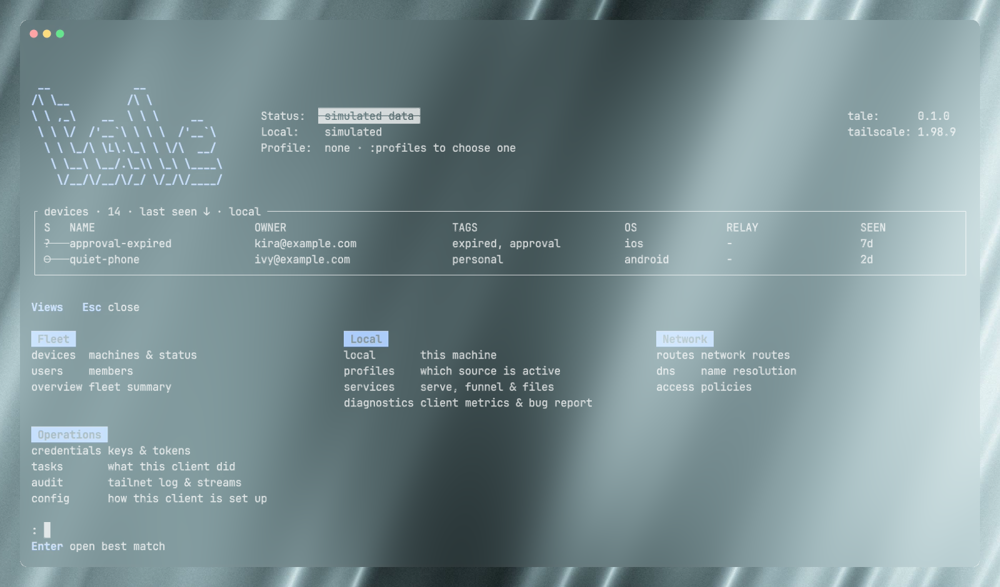

# Tale

Use Tale to understand and work with your Tailscale network without leaving the
terminal. Start with the node you are on, then move into your tailnet when you
need to inspect devices, people, routes, DNS, access policy, services, or
recent activity.

Tale is keyboard-first: press `:` to go anywhere, `/` to narrow a list, `a` for
available actions, and `?` whenever you want the keys for the screen in front
of you.

> **Experimental:** Tale has no Supported 1.0 platform releases yet. It is best
> used from a checkout for evaluation and development. See the
> [support matrix](docs/support.md) for the evidence behind that status.

<p align="center">
  <a href="docs/assets/tale-devices.png">
    
  </a>
</p>

<table>
  <tr>
    <td width="50%"><strong>Services and exposure</strong></td>
    <td width="50%"><strong>Resource-first navigation</strong></td>
  </tr>
  <tr>
    <td>
      <a href="docs/assets/tale-services.png">
        
      </a>
    </td>
    <td>
      <a href="docs/assets/tale-navigation.png">
        
      </a>
    </td>
  </tr>
</table>

## Start here

You need a stable Rust toolchain, a terminal with alternate-screen support, and
an installed Tailscale client if you want to inspect or operate the local node.
From this checkout:

```sh
cargo install --locked --path .
tale
```

The first launch works locally and does not require an admin credential. Use
`tale config check` to validate configuration and `tale config path` to see
where Tale keeps it.

### Connect a tailnet profile

Add an admin profile only when you need tailnet-wide information or actions.
Use a least-privilege Control API credential; a read-only profile is the right
choice when you only need visibility.

```sh
printf '%s' "$TOKEN" |
  tale auth add ops --tailnet TAILNET_ID --kind access-token --secret-stdin
tale --profile ops --read-only
```

Tale keeps credentials separate from shareable configuration. Before opening a
profile with write access, review [configuration](docs/configuration.md) and
[security](docs/security.md).

## Everyday navigation

| Want to… | Try this |
| --- | --- |
| Check this computer’s Tailscale connection | Open `local` with `:local` |
| Find a device or person | Open `devices` or `users`, then press `/` |
| Inspect routing, DNS, access, or services | Use `:routes`, `:dns`, `:access`, or `:services` |
| Refresh information | Press `r` for the current view or `R` for all of its sources |
| See what Tale did | Open task history with `@` |
| Return to a prior view | Press `[` or `]` |

Destructive actions are never bound to a single direct key: they live behind
`a` and require typed confirmation. Tale also does not automatically upload
doctor or support data.

## Help and reference

If something is not working, start with [troubleshooting and recovery](docs/troubleshooting.md).
For a safe diagnostic summary, run `tale doctor`; it is non-mutating and
redacts its output.

- [Installation](docs/install.md)
- [Configuration](docs/configuration.md)
- [Keyboard navigation and user flows](docs/ux.md)
- [Support matrix](docs/support.md)
- [Security](docs/security.md)
- [Troubleshooting and recovery](docs/troubleshooting.md)
- [`tale(1)` man page](docs/cli/tale.1)

## Developing Tale

Contributors can find the project’s [design principles](DESIGN.md),
[architecture](docs/architecture.md), [feature catalog](docs/product.md), and
[release checklist](docs/release-checklist.md) in the documentation. To refresh
the screenshots above, use the instructions in
[`scripts/capture-readme-screenshots.sh`](scripts/capture-readme-screenshots.sh).
